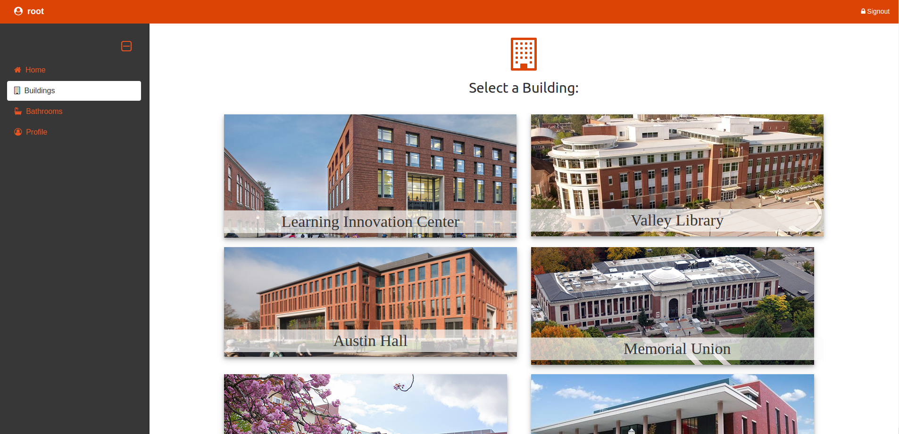
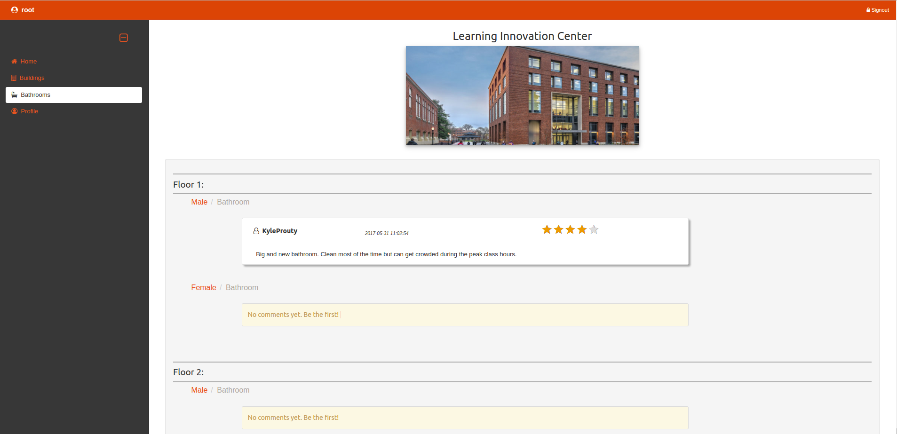
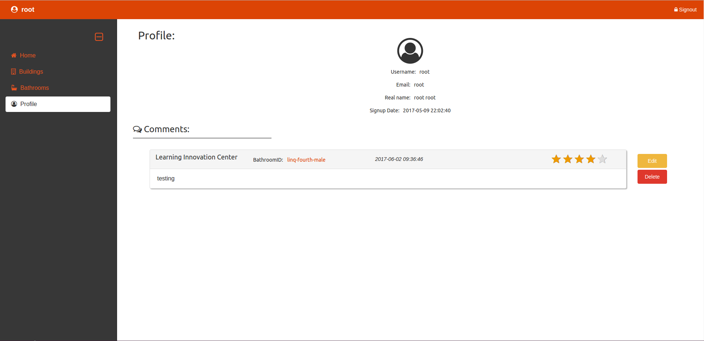

http://web.engr.oregonstate.edu/~proutyky/#!/

# 
# 
# 
# 

[AngularJS, Bootstrap, PHP, MySQL]

Inspiration for this project was RateMyProfessor. 

Our site allows users to view a list of public bathrooms located around Oregon State's campus. 

A user can select a building from the list of buildings and will be redirected to the bathroom page which shows all the public bathrooms in that building with comments and ratings from users who have registered. 

If a user registers an account they are given the option to make comments and rating on bathrooms. Having an account gives you access to a profile page which allows the user to view, delete, and edit comments they have made on bathrooms.

Developed for CS340 Database class.
